<h1 align="center">Fundamentos Arquitetura de Software</h1>

<p align="center">Projeto sobre os Fundamentos de Arquitetura de Software onde documento os conceitos fundamentais de OOP - SOLID - Dependency Injection - Clean Code - Design Patterns</p>

---

### :dart: Objetivo

Tenho como objetivo implementar uma documentação a respeito dos fundamentos de software para que possa servir de estudo e consulta sobre o tema abordado. Trata-se de uma aplicação que tem **somente** como propósito a **descrição e exemplificação** dos temas abordados. Desenvolvida em C# com os conceitos fundamentais de OOP - SOLID - Dependency Injection - Clean Code - Design Patterns

### Clone

Clone este repositório em sua máquina local usando:  

```
git clone https://github.com/YuriSiman/software-architecture-fundamentals.git
```

### :pencil2: Tópicos

- [x] [OOP](https://github.com/YuriSiman/software-architecture-fundamentals#oop)  
- [x] [SOLID](https://github.com/YuriSiman/software-architecture-fundamentals#solid)  
- [x] [Clean Code](https://github.com/YuriSiman/software-architecture-fundamentals#clean-code)  
- [x] [Design Patterns](https://github.com/YuriSiman/software-architecture-fundamentals#design-patterns)  
- [x] [Estilos e Padrões Arquiteturais](https://github.com/YuriSiman/software-architecture-fundamentals#estilos-e-padrões-arquiteturais)  

---

## :rocket: Vamos Começar 

## O que é Arquitetura?

"Arquitetura é a organização fundamental de um sistema incorporada em seus componentes, relacionamentos com o ambiente e os princípios que conduzem seu design e evolução."   [ISO/IEC/IEEE 42010-2011](https://www.iso.org/standard/50508.html)

Como construir software:

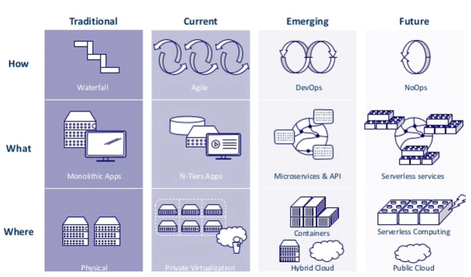

### TOGAF

The Open Group Architecture Framework (TOGAF) é um framework de arquitetura corporativa que provê uma abordagem global ao design, planejamento, implementação e governança de uma arquitetura corporativa.

[OpenGroup](https://www.opengroup.org/togaf)

### ISO/IEC/IEEE 42010-2011

Engenharia de sistemas e software ISO / IEC / IEEE 42010 - A descrição da arquitetura é um padrão internacional para descrições de arquitetura de sistemas e software.

[ISO/IEC/IEEE 42010-2011](https://www.iso.org/standard/50508.html)  

[Voltar ao Início](https://github.com/YuriSiman/software-architecture-fundamentals#fundamentos-arquitetura-de-software)  

---

## OOP

É essencial possuir um claro conhecimento dos princípios da orientação a objetos para poder aplicar as melhores práticas de design de código, padrões e abordagens de arquitetura. Na orientação a objetos devemos sempre buscar o baixo acoplamento e a alta coesão entre os objetos, ou seja, evitar uma dependência direta entre um objeto e outro, tendo os objetos executando uma única responsabilidade livres de uma dependência direta com outros.

Pilares da Programação Orientada a Objetos


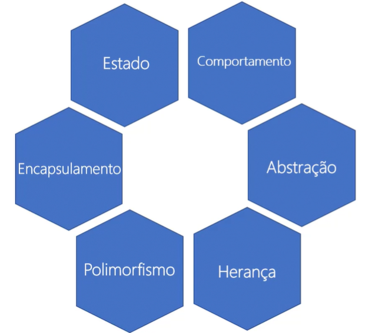

[Visualizar Código](https://github.com/YuriSiman/software-architecture-fundamentals/tree/master/OOP)  
[Voltar ao Início](https://github.com/YuriSiman/software-architecture-fundamentals#fundamentos-arquitetura-de-software)  

---

## SOLID

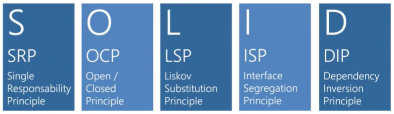

SOLID é um acrônimo dos cinco primeiros princípios da programação orientada a objetos e design de código identificados por Robert C. Martin (Uncle Bob) por volta do ano 2000. Os princípios SOLID devem ser aplicados para se obter os benefícios da orientação a objetos, como:

- Seja fácil de se manter, adaptar e se ajustar às alterações de escopo
- Seja testável e de fácil entendimento
- Seja extensível para alterações com o menor esforço necessário
- Que forneça o máximo de reaproveitamento
- Que permaneça o máximo de tempo possível em utilização

Problemas comuns que conseguimos evitar quando utilizamos os princípios SOLID:

- Dificuldade na testabilidade / criação de testes de unidade
- Código macarrônico, sem estrutura ou padrão
- Dificuldades de isolar funcionalidades
- Duplicação de código, uma alteração precisa ser feita em N pontos
- Fragilidade, o código quebra facilmente em vários pontos após alguma mudança 

### SRP - Single Responsability Principal

Uma classe deve ter **um,e apenas um,** motivo para ser modificada.

### OCP - Open Closed Principle

Entidades de software (classes, módulos, funções, etc...) devem estar abertas para extensão, mas fechadas para modificação.

### LSP - Liskov Substitution Principle

O principal objetivo do LSP é questionar se o desenvolvedor está realizando uma herança dentro dos padrões de design e abstração ou está apenas seguindo a linha do "é um...". Subclasses devem ser substituíveis por suas Superclasses. Este princípio reswolve o problema de heranças que não deveriam ser implementadas.

Se q(x) é uma propriedade demonstrável dos objetos x de tipo T. Então q(y) deve ser verdadeiro para objetos y de tipo S onde S é um subtipo de T.

### ISP - Interface Segregation Principle

Clientes não devem ser forçados a depender de métodos que não usam. Muitas interfaces específicas são melhores do que uma interface única. Delegar contratos (interfaces) é uma forma de garantir  design e abstração do código.

### DIP - Dependency Inversion Principle

Módulos de alto nível não devem depender de módulos de baixo nível. Ambos devem depender de abstrações. Abstrações não devem depender de detalhes. Detalhes devem depender de abstrações.

Dependa de uma abstração e não de uma implementação.

[Visualizar Código](https://github.com/YuriSiman/software-architecture-fundamentals/tree/master/SOLID)  
[Voltar ao Início](https://github.com/YuriSiman/software-architecture-fundamentals#fundamentos-arquitetura-de-software)  

---

## Clean Code

### O que é um código limpo?

- Simples
- Direto
- Eficiente
- Sem duplicidade
- Elegante
- Feito com cuidado
- Fácil de ler

"Qualquer tolo consegue escrever código que um computador entenda. Bons programadores escrevem código que humanos possam entender".  
Martin Fowler

### Quanto custa um código ruim?

- Alta rotatividade
- Demora na entrega de novas funcionalidades
- Dificuldade na manutenção
- Alta incidência de bugs
- Perda de confiança do cliente
- Desmotivação profissional
- Mais tempo depurando o código do que escrevendo

### Como medir um bom código?

- Quantidade de linhas de código (Devemos buscar reduzir ao máximo o tamanho do código, dependendo do projeto)
- Número de métodos (Devemos buscar utilizar a maior quantidade de métodos para um desacoplamento maior)
- Número de classes (Devemos buscar utilizar a maior quantidade de métodos para um desacoplamento maior)
- Linhas de código por método (Devemos buscar reduzir a quantidade de linhas dentro do método)
- Complexidade ciclomática (Evitar uma grande quantidade de caminhos de execução independentes, ou seja, evitar if's encadeados)
- Número de estruturas de decisão (Evitar um exagero de estruturas de decisão)
- Escolher os nomes que revelem intenção (Revelando o motivo dele existir, o que faz e como é usado. Utilizar nomes fáceis de se encontrar, evitando siglas ou acrônimos. Não economizar palavras para dar nome a alguma coisa)

### Boas práticas

- Nome de classes devem ser substantivos e não devem conter verbos. Ex: ClienteRepository
- Nomes de métodos devem conter verbos de preferência no infinitivo. Ex: AdicionarCliente
- Não ser genérico. Ex: ProcessarFolhaPagamento / CalcularImpostoRenda
- Menos é mais! "A primeira regra dos métodos é que eles devem ser pequenos. A segunda regra é que eles devem ser menores ainda". Uncle Bob
    - Métodos <= 20 linhas
    - Linha <= 100 caracteres
    - Classe <= 500 linhas
- Extraia trechos de métodos privados
- Métodos devem fazer apenas uma coisa, fazê-la certa e somente fazê-la
- Evite muitos parâmetros em métodos
- Não deixe o método mentir dizendo que faz uma coisa mas na verdade faz outras "escondidas"
- Se o método tiver mais de uma responsabilidade, extraia em dois ou mais
- Leia seu método de cima para baixo como uma narrativa, ele deve fazer sentido
- Aplique uma boa indentação

### Comentários

- Comentários não vão ajudar um código ruim ser melhor interpretado
- Um código que requer comentário precisa ser reescrito
- Não deixe trechos de código comentado

Quando comentar?

- Alertar consequências que podem vir a causar
- Licença, direitos autorais, etc...
- Necessidade de explicar uma regra de negócio interna
- Decisões de design de código
- Utilizar comentários quando os mesmos geram uma documentação do código (Ainda assim, não é tão recomendado)

### Tratamento de erros

- Tratar e prever possíveis exceções é de responsabilidade do desenvolvedor
- Retorne exceptions e não códigos de erro
- Informe o máximo que puder em sua exception
- Se necessário crie exceptions personalizadas para um problema específico
- Não retorne null

[Voltar ao Início](https://github.com/YuriSiman/software-architecture-fundamentals#fundamentos-arquitetura-de-software)  

---

## Design Patterns

Design Patterns são padrões de código para solução de problemas conhecidos. O objetivo não é reinventar a roda, mas sim aplicar uma solução com um bom design de código. O conceito de padrões foi introduzido por 4 desenvolvedores intitulados Gang of Four (GoF) e hoje conta com 23 padrões fundamentais. Atualmente existem mais de 80 padrões conhecidos que são em geral variações dos 23 patterns do GoF.

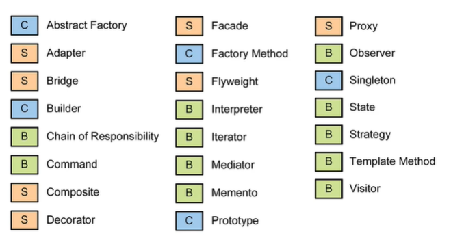

Os padrões do GoF estão divididos em 3 famílias:

Família | Descrição
------------ | -------------
Creational Patterns (Criacional) | Fornecem meios de criação de um objeto e de como ele será instanciado
Structural Patterns (Estrutural) | Tratam da composição de objetos por heranças e interfaces para diferentes funcionalidades
Behavioral Patterns (Comportamental) | Tratam das interações e comunicação entre os objetos além da divisão de responsabilidades

[.NET Design Patterns](https://dofactory.com/net/design-patterns)

### Creational Patterns

- Abstract Factory

Cria uma instância de diversas famílias de classes. Criar fábrica abstrata de fábricas.

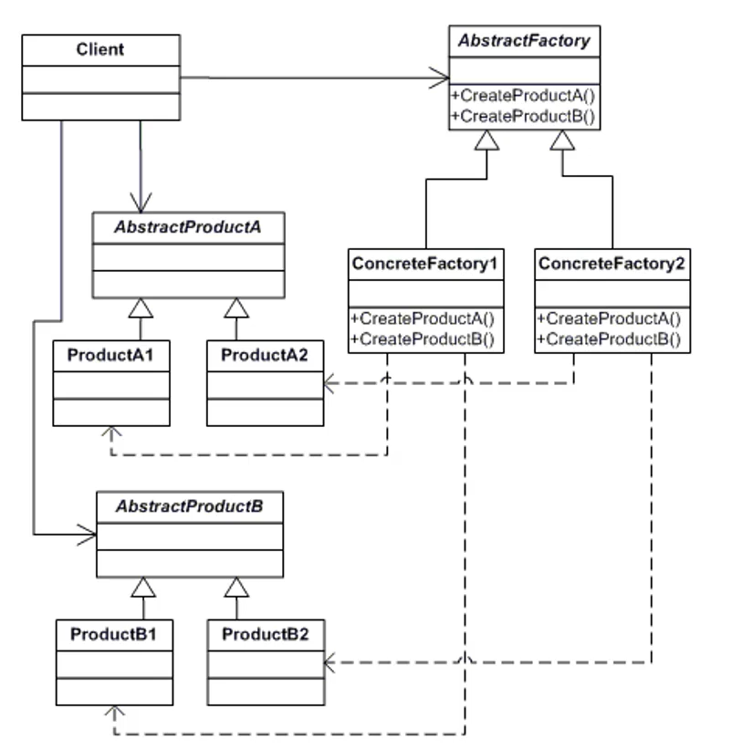

[Visualizar Código](https://github.com/YuriSiman/software-architecture-fundamentals/tree/master/DesignPatterns/01%20-%20Creational/1.1%20-%20Abstract%20Factory)  

- Factory Method

Cria uma instância de diversas derivações de classes

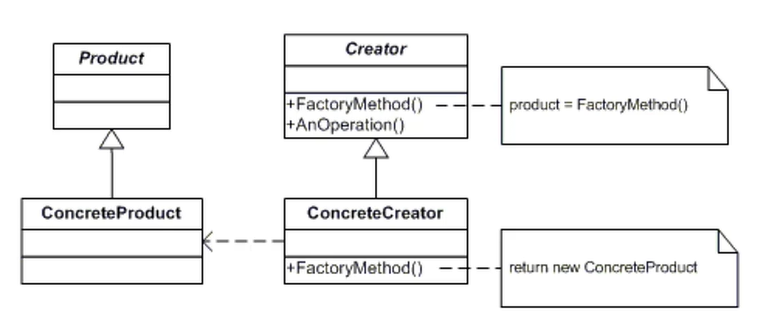

[Visualizar Código](https://github.com/YuriSiman/software-architecture-fundamentals/tree/master/DesignPatterns/01%20-%20Creational/1.2%20-%20Factory%20Method)  

- Singleton

Cria uma única instância que será utilizada por os recursos

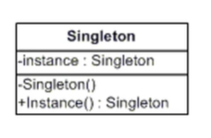

[Visualizar Código](https://github.com/YuriSiman/software-architecture-fundamentals/tree/master/DesignPatterns/01%20-%20Creational/1.3%20-%20Singleton)  

### Structural Patterns

- Adapter

Compatibiliza objetos de interfaces diferentes

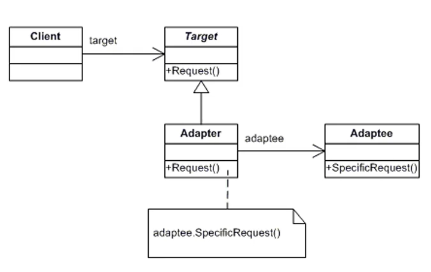

[Visualizar Código](https://github.com/YuriSiman/software-architecture-fundamentals/tree/master/DesignPatterns/02%20-%20Structural/2.1%20-%20Adapter)  

- Facade

Uma única classe que representa um subsistema

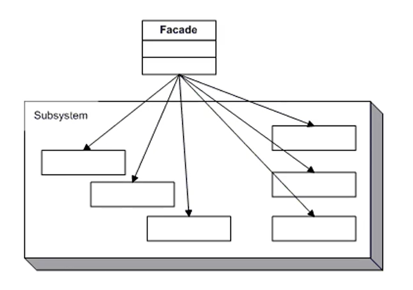

[Visualizar Código](https://github.com/YuriSiman/software-architecture-fundamentals/tree/master/DesignPatterns/02%20-%20Structural/2.2%20-%20Facade)  

- Composite

Compartilha um objeto em estruturas de árvores que representam hierarquias

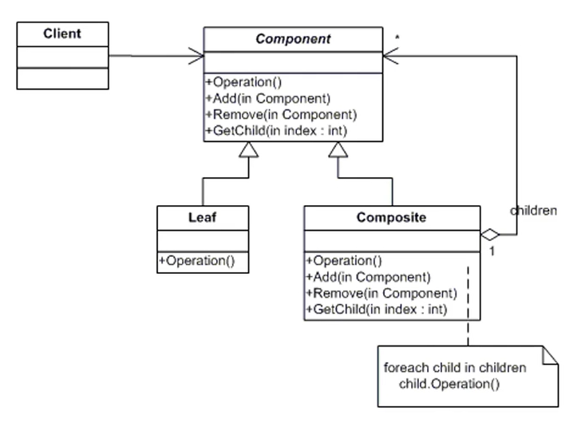

[Visualizar Código](https://github.com/YuriSiman/software-architecture-fundamentals/tree/master/DesignPatterns/02%20-%20Structural/2.3%20-%20Composite)  


### Behavioral Patterns

- Command

Encapsula um command request em um objeto

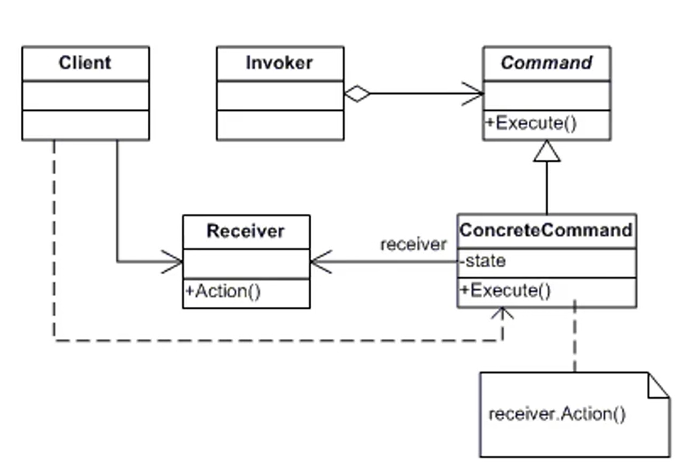

[Visualizar Código](https://github.com/YuriSiman/software-architecture-fundamentals/tree/master/DesignPatterns/03%20-%20Behavioral/3.1%20-%20Command)  

- Strategy

Encapsula um algoritimo dentro de uma classe

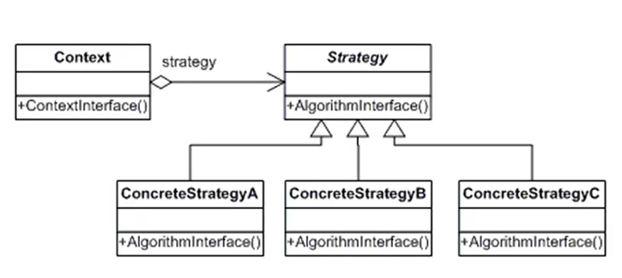

[Visualizar Código](https://github.com/YuriSiman/software-architecture-fundamentals/tree/master/DesignPatterns/03%20-%20Behavioral/3.2%20-%20Strategy)  

- Observer

Uma forma de notificar mudanças a uma série de classes

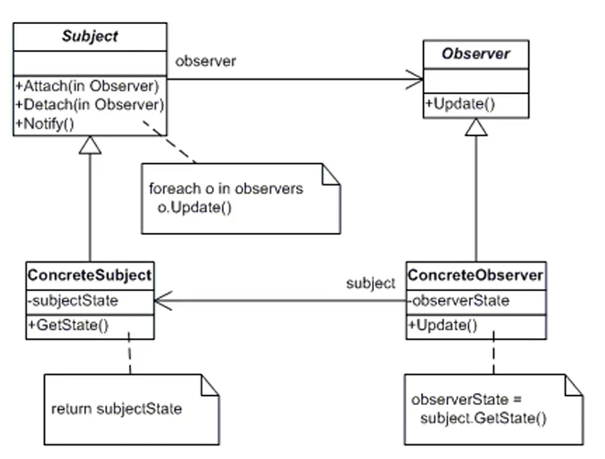

[Visualizar Código](https://github.com/YuriSiman/software-architecture-fundamentals/tree/master/DesignPatterns/03%20-%20Behavioral/3.3%20-%20Observable)  

---

### Estilos e Padrões Arquiteturais

Um estilo arquitetura é uma **abordagem** de como **projetar** e entregar uma aplicação. Trata-se de como **organizar** os **componentes** responsáveis de uma arquitetura, como eles irão **interagir** entre si e quais **aspectos tecnológicos** irão atender. 

- Arquitetura Monolítica

IMAGEM

- Arquitetura em Camadas

IMAGEM

- Arquitetura REST

IMAGEM

- Arquitetura de Microservices

IMAGEM

- Arquitetura de Plugin

IMAGEM

- Arquitetura Client-Server

IMAGEM

- Arquitetura Pines and Filters

IMAGEM

Os Padrões Arquiteturais são semelhantes aos "Design Patterns", mas possuem um escopo diferente. Padrões Arquiteturais são estratégias de alto nível que dizem respeito a componentes de grande escala, as propriedades e mecanismos globais de um sistema. Um projeto de arquitetura pode conter diversos estilos arquiteturais, e cada estilo arquitetural pode utilizar diversos padrões arquiteturais. Um padrão arquitetural pode ser um subconjunto de um estilo arquitetural visando um escopo específico. O padrão arquitetural é uma solução geral e reutilizável para um problema em um contexto particular. É uma solução recorrente para um problema recorrente.

- Tier Architecture (Arquitetura 3 camadas)

Cássica maneira de distribuir responsabilidades (apresentação, aplicação/negócios e acesso a dados). Pode ser aplicada em diversos cenários, porém geralmente é mais encontrada em aplicações com foco comercial.

IMAGEM

- Onion Architecture (Arquitetura Cebola - Clean Architecture)

Padrão Arquitetural que, para chegar na camada mais interna, é necessário passar pelas camadas externas.

IMAGEM

- Arquitetura Hexagonal (Ports & Adapters)

Tem como objetivo implementar a Onion Architecture, DDD, Clean, CQRS, mensageria... tudo junto na mesma aplicação. Permite que seja possível fazer qualquer coisa na arquitetura.

IMAGEM

- CQRS - Command Query Responsibility Segregation

Um padrão arquitetural onde o foco principal é separar os meios de leitura e escrita de dados. Alterações de dados são realizados via Commands e leitura de dados são realizados via Queries. O objetivo do CQRS é prover expressividade para aplicação, pois todos os Commands representam uma intenção de negócio. CQRS promove a consistência eventual, que é quando possuímos um banco de leitura e outro de escrita com os mesmos dados, porém os dados não são consistidos exatamente no mesmo momento. Muito aplicado em arquiteturas hexagonais, microservices ou em aplicações que possuem uma alta demanda de consumo de dados. 

Commands: Representam uma intenção de mudanças no estados de uma entidade. São expressivos e representam uma única intenção de negócio.
Queries: É a forma de obter dados de um banco ou origem de dados para atender as necessidades da aplicação.

IMAGEM

- Event Sourcing

É um Padrão Arquitetural - "Nós podemos buscar o estado de uma aplicação para encontrar o estado atual do mundo, e isso responde muitas perguntas. Entretanto há momentos que nós não só querermos ver onde nós estamos, mas também queremos saber como chegamos lá." - Martin Fowler.

"Event Sourcing assegura que todas as mudanças feitas no estados de uma aplicação são armazenadas como uma sequência de eventos. Não só podemos buscar esses eventos, mas também podemos usar este log de eventos para reconstruir estados passados e ajustar automaticamente o estado atual com mudanças retroativas." - Martin Flowler

A ideia central é persistir todos estados anteriores de uma entidade de negócio desde o momento de sua ciraçãop. Com estes dados é possível realizar o "replay" dos fatos passados para entender o comportamento do usuário, trabalhar com Big Data, Machine Learning, realizar testes de integração com cenários reais ou simplesmente recriar as entidades se necessário.

IMAGEM

- DDD (Domain-Driven Design)

Indicado para aplicações complexas, com muitas entidades e regras de negócio. Um "guia" de como entender o negócio, organizá-lo em um conjunto de princípios, criar uma modelagem com base no negócio e implementar utilizando diversas boas práticas.

Processos de "implementação" do DDD:

- Entender o negócio
- Extrair a Linguagem Ubíqua (Vocabulário de todos os termos específicos do domínio)
- Modelagem Estratégica (Segregar seu domínio em partes menores e responsáveis com Mapa de Contextos - Context Map - que pode ser representado através de imagens e uma simples documentação do tipo de relacionamento entre os contextos)
- Definir a Arquitetura
- Modelagem Tática 
    - Aggregate Object: Uma entidade que é a raiz agregadora de um processo do domínio que envolve mais de uma entidade.
    - Domain Model: Uma entidade do domínio, possui estados e comportamentos. lógica de negócios, getters e setters AdHoc, etc...
    - Value Object: Um objeto que agrega valor às entidades, não possui identidade e é imutável.
    - Factory: Classe responsável por construir adequadamente um objeto / entidade.
    - Domain Service: Serviço do domínio que atende partes do negócio que não se encaixam em entidades específicasq, trabalha com diversas entidades, realiza persistência através de repositórios e etc...
    - Application Service: Serviço de aplicação que orquestra ações disparadas pela camada de apresentação e fornece DTO's para comunicação entre as demais camadas e para o consumo da camada de apresentação.
    - Repository: Uma classe que realiza a persistência das entidades se comunicando diretamente com o meio de acesso aos dados, é utilizado apenas um repositório por agregação.
    - External Service: Serviço externo que realiza a consulta/persistência de informações por meios diversos.  

IMAGEM

- Arquiteturas Evolutivas

"Um arquiteto permite que decisões importantes sejam adiadas e um bom arquiteto maximiza o número de decisões não tomadas." - Uncle Bob

"Uma arquitetura evolutiva suporta mudanças contínuas e incrementais como um primeiro princípio por meio de vários aspectos." - Rebecca Parsons

"Mudanças são inevitáveis. A evolução, no entando, é opcional." - Tony Robbins

---

## :vertical_traffic_light: Status do Projeto

:construction: Projeto sendo implementado :construction:

---

## :thinking: Contribuindo

> Para começar...

### Passo 1

* :fork_and_knife: Fork este repositório!

### Passo 2

* :dancers: Clone este repositório para sua máquina local usando `git clone https://github.com/YuriSiman/fundamentals-software-architecture.git`

### Passo 3

* :trident: Crie sua feature branch usando `git checkout -b minha-feature`

### Passo 4

* :white_check_mark: Commit suas mudanças usando `git commit -m "feat: Minha nova feature"`

### Passo 5

* :pushpin: Dê um push usando `git push -u origin minha-feature`

### Passo 6

* :arrows_clockwise: Crie um novo pull request

Depois que seu pull request for mesclado, você pode excluir sua feature branch  

> Caso tenha dúvidas, confira este guia de como [contribuir no GitHub](https://github.com/firstcontributions/first-contributions)  

---

## :speech_balloon: Suporte

> Entre em contato comigo...  

* Me chame pelo [Linkedin](https://www.linkedin.com/in/yurisiman/)  
* Me mande um e-mail [contato@yurisiman.com.br](mailto:contato@yurisiman.com.br)  

[](https://github.com/YuriSiman)  
[](https://yurisiman.com.br)  

---

## :pencil: Licença

[](https://github.com/YuriSiman/software-architecture-fundamentals/blob/master/LICENSE)   

---

Code your life...

